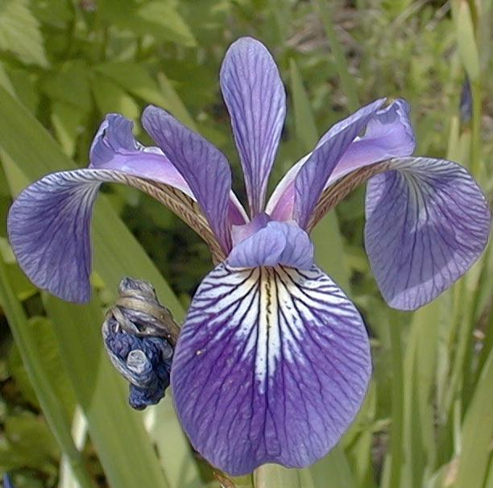

# Programming_Scripting_Project
This project is comprised of research into the Fisher’s Iris data set.

# Project Statement
The project initially is comprised of research in the Iris Data Set. This will include, but is not limited to, the original publication of the data set, the development of the data set as historical significant, current methods utilised to analyse and visualize the various characteristics of the data.

^ Re-edit: Update throughout project i.e. research findings

# Initial Research
Ronald Fisher, a British statistician and biologist, first introduced the Iris Data set in 1936 in an article published in the peer-reviewed journal *Annals of Human Genetics*. [1] The article, *The use of multiple measurements in taxonomic problems*, details the measurements of three species of Iris flower that were growing within the same colony. The four measurements taken, for fifty of each the species, were the Sepal length, Sepal width, Petal length and Petal width. These measurements, which can be seen in table I of the article, would become the well known and commonly used Iris Data set. The three species were the iris setosa, iris versicolor and iris virginica.

<b>Iris Setosa</b> [2]

<b>Iris Versicolor</b> [2]

<b>Iris Virginica</b> [2]

The article continues to describe the arithmetical produce utilized in the analysis of the data. Beginning with the observed means and their differences for two of the species before specifying more in-depth statistical analysis. [1]

# References **Edit to Havard Style*

[1] https://onlinelibrary.wiley.com/doi/epdf/10.1111/j.1469-1809.1936.tb02137.x

[2] http://mirlab.org/jang/books/dcpr/dataSetIris.asp?title=2-2%20Iris%20Dataset
