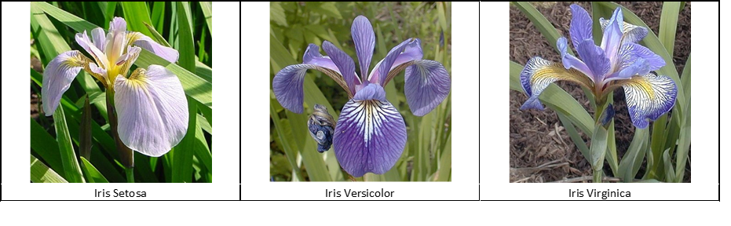

# Programming_Scripting_Project
This project is comprised of research into the Fisher’s Iris data set.

# Project Statement
The project initially is comprised of research in the Iris Data Set. This will include, but is not limited to, the original publication of the data set, the development of the data set as historical significant, current methods utilised to analyse and visualize the various characteristics of the data.

^ Re-edit: Update throughout project i.e. research findings

# Initial Research
Ronald Fisher, a British statistician and biologist, first introduced the Iris Data set in 1936 in an article published in the peer-reviewed journal *Annals of Human Genetics*. [1] The article, *The use of multiple measurements in taxonomic problems*, details the measurements of three species of Iris flower that were growing within the same colony. The four measurements taken, for fifty of each the species, were the Sepal length, Sepal width, Petal length and Petal width. These measurements, which can be seen in table I of the article, would become the well known and commonly used Iris Data set. The three species were the iris setosa, iris versicolor and iris virginica.

<b>Image 1:</b> Three species of Iris flower utilized in the data set. [2]

The article continues to describe the arithmetical produce utilized in the analysis of the data. Beginning with the observed means and their differences for two of the species before specifying more in-depth statistical analysis. [1]

# Python Research
Upon beginning to research the methods into how to visualize the Iris Data set, Pandas Dataframes was discovered. Several tools are available to aid in the understanding and use. 

Steps:
* Downloaded the Iris Data Set and subsequently imported the data into pandas.
~~~~
#Import Iris Data set into Pandas
raw_data="iris.data.csv"
dataset = pandas.read_csv(raw_data)
~~~~
* Verified that the sample size of each species was 50. As in accordance with the background research.
~~~
#Count the size of each Species
print(dataset.groupby('species').size())
~~~
* Using dataset.describe, *insert reference*,  to generate descriptive statistics. This includes the Count, Mean, STD, Min & Max and the percentiles of the dataset. Subsequently, this was visualized using the print function and finally this was saved into a CSV file.
~~~
# Describe the Data set
print(dataset.describe())

# Saving Data to a CSV file
data_full = dataset.describe()
data_full.to_csv('Data_Set_Breakdown.csv',sep=',')
~~~
 
|       | sepal_length       | sepal_width        | petal_length       | petal_width        | 
|-------|--------------------|--------------------|--------------------|--------------------| 
| count | 150.0              | 150.0              | 150.0              | 150.0              | 
| mean  | 5.843333333333335  | 3.0540000000000007 | 3.7586666666666693 | 1.1986666666666672 | 
| std   | 0.8280661279778629 | 0.4335943113621737 | 1.7644204199522617 | 0.7631607417008414 | 
| min   | 4.3                | 2.0                | 1.0                | 0.1                | 
| 25%   | 5.1                | 2.8                | 1.6                | 0.3                | 
| 50%   | 5.8                | 3.0                | 4.35               | 1.3                | 
| 75%   | 6.4                | 3.3                | 5.1                | 1.8                | 
| max   | 7.9                | 4.4                | 6.9                | 2.5                | 

<b>Table 1:</b> Descriptive Statistics for entire dataset, were percentage is representational of pertentiles.

* This was repeated for all three species. *Describe in more detail*
~~~
# Creating a DataFrame for each Species
# Setosa
setosa = dataset[dataset['species']=='setosa']
print(setosa.describe())
setosa.to_csv('Data_Setosa_Breakdown.csv',sep=',')

# Versicolor
versicolor = dataset[dataset['species']=='versicolor']
print(versicolor.describe())
versicolor.to_csv('Data_Versicolor_Breakdown.csv',sep=',')

# Virginica
virginica = dataset[dataset['species']=='virginica']
print(virginica.describe())
virginica.to_csv('Data_Virginica_Breakdown.csv',sep=',')
~~~
  * Setosa

|       | sepal_length       | sepal_width         | petal_length       | petal_width         | 
|-------|--------------------|---------------------|--------------------|---------------------| 
| count | 50.0               | 50.0                | 50.0               | 50.0                | 
| mean  | 5.005999999999999  | 3.4180000000000006  | 1.464              | 0.2439999999999999  | 
| std   | 0.3524896872134512 | 0.38102439795469095 | 0.1735111594364455 | 0.10720950308167837 | 
| min   | 4.3                | 2.3                 | 1.0                | 0.1                 | 
| 25%   | 4.8                | 3.125               | 1.4                | 0.2                 | 
| 50%   | 5.0                | 3.4                 | 1.5                | 0.2                 | 
| 75%   | 5.2                | 3.6750000000000003  | 1.5750000000000002 | 0.3                 | 
| max   | 5.8                | 4.4                 | 1.9                | 0.6                 | 

* *paste code & dataset.describe*
* Scatterplots were created for all three species & a combined scatter plot. Subsequently saved.
* *paste code & Scatterplots & describe trends noted*

# References **Edit to Havard Style*

[1] https://onlinelibrary.wiley.com/doi/epdf/10.1111/j.1469-1809.1936.tb02137.x

[2] http://mirlab.org/jang/books/dcpr/dataSetIris.asp?title=2-2%20Iris%20Dataset

[3] https://pandas.pydata.org/pandas-docs/stable/visualization.html

[4] https://www.datacamp.com/community/tutorials/pandas-tutorial-dataframe-python#question1

[5] https://www.kaggle.com/abhishekkrg/python-iris-data-visualization-and-explanation

[6] https://en.support.wordpress.com/markdown-quick-reference/
