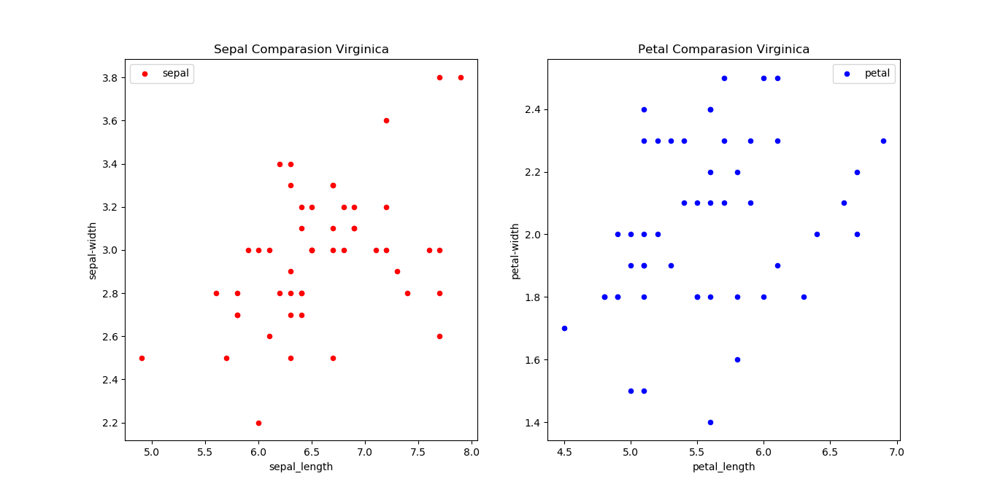

# Programming_Scripting_Project
This project is comprised of research into the Fisher’s Iris data set.

# Project Statement
The project initially is comprised of research in the Iris Data Set. This will include, but is not limited to, the original publication of the data set, current methods utilised to analyse and visualize the various characteristics of the data. A machine learning tutorial was also followed. This allowed for the visualisation of the data in greater detail. It also aided in the understanding of the techniques used in data analytics.

# Initial Research
Ronald Fisher, a British statistician and biologist, first introduced the Iris Data set in 1936 in an article published in the peer-reviewed journal *Annals of Human Genetics*. [1] The article, *The use of multiple measurements in taxonomic problems*, details the measurements of three species of Iris flower that were growing within the same colony. The four measurements taken, for fifty of each the species, were the Sepal length, Sepal width, Petal length and Petal width. These measurements, which can be seen in table I of the article, would become the well-known and commonly used Iris Data set. The three species were the iris setosa, iris versicolor and iris virginica.

<b>Image 1:</b> Three species of Iris flower utilized in the data set. [2]

The article continues to describe the arithmetical produce utilized in the analysis of the data. Beginning with the observed means and their differences for two of the species before specifying more in-depth statistical analysis. [1]

# Python Research
Upon beginning to research the methods into how to visualize the Iris Data set, Pandas Dataframes was discovered. Several tools are available to aid in the understanding and use. 

Steps:
* Downloaded the Iris Data Set and subsequently imported the data into pandas.
~~~~
#Import Iris Data set into Pandas
raw_data="iris.data.csv"
~~~~
* Verified that the sample size of each species was 50. As in accordance with the background research. This was later updated to include user input. This allowed the user to select the sections of code to run and therefore increased the speed that the code took to run.
~~~
# Q: Print Basic Data?
if input("Would you like to view a basic descriptive statistics for the full dataset? (Y/N): ") == "Y":
    #Count the size of each Species
    print(dataset.groupby('species').size())

    # Describe the Data set
    print(dataset.describe())
~~~
* Using dataset.describe [5] to generate descriptive statistics. This includes the Count, Mean, STD, Min & Max and the percentiles of the dataset. Subsequently, this was visualized using the print function and finally this was saved into a CSV file. This was subsequently updated to check if the CSV file already existed before creating the file. This again increased the speed at which the code would take to run post the first run. [8]

* It can be noted by referring to the standard deviation (std), that the petal length has the widest variation of between the three species. While sepal width has the lowest. This can be verified by reviewing the min and max values of the each i.e. Petal Length; Min: 1.0, Max: 6.9 and Sepal Width; Min: 2.0, Max: 4.4. The petal length has a much higher spread. By drilling down further and creating a descriptive table for each of the species, it can be tested if this will be seen across all the species.
~~~
# Saving Data to a CSV file
data_full = dataset.describe()
# Check is CSV file already exists (https://www.cyberciti.biz/faq/python-file-exists-examples/)
if ( not os.path.isfile('Data_Set_Breakdown.csv')):
    data_full.to_csv('Data_Set_Breakdown.csv',sep=',')
~~~
 
|       | sepal_length       | sepal_width        | petal_length       | petal_width        | 
|-------|--------------------|--------------------|--------------------|--------------------| 
| count | 150.0              | 150.0              | 150.0              | 150.0              | 
| mean  | 5.843333333333335  | 3.0540000000000007 | 3.7586666666666693 | 1.1986666666666672 | 
| std   | 0.8280661279778629 | 0.4335943113621737 | 1.7644204199522617 | 0.7631607417008414 | 
| min   | 4.3                | 2.0                | 1.0                | 0.1                | 
| 25%   | 5.1                | 2.8                | 1.6                | 0.3                | 
| 50%   | 5.8                | 3.0                | 4.35               | 1.3                | 
| 75%   | 6.4                | 3.3                | 5.1                | 1.8                | 
| max   | 7.9                | 4.4                | 6.9                | 2.5                | 

<b>Table 1:</b> Descriptive Statistics for entire dataset, were percentage is representational of pertentiles.

* This was repeated for all three species. Similar to the above, the code was subsequently updated to allow user input and to first check if the CSV file exists before creating a file.

* In contrast the high standard deviation noted for petal length, when viewing the data across all species. When each species is analysed individually the standard deviation is lowered significantly. This may indicate that petal length is a key indicator in the differences between the species. Further visualisation of the data will confirm this.
~~~
# Creating a DataFrame for each Species
# Setosa
setosa = dataset[dataset['species']=='setosa']
data_setosa = setosa.describe()
# Q: Print Basic Data?
if input("Would you like to view a basic descriptive statistics for the setosa dataset? (Y/N): ") == "Y":
    print(setosa.describe())
# Check is CSV file already exists (https://www.cyberciti.biz/faq/python-file-exists-examples/)
if ( not os.path.isfile('Data_Setosa_Breakdown.csv')):
    data_setosa.to_csv('Data_Setosa_Breakdown.csv',sep=',')

# Versicolor
versicolor = dataset[dataset['species']=='versicolor']
data_versicolor = versicolor.describe()
# Q: Print Basic Data?
if input("Would you like to view a basic descriptive statistics for the versicolor dataset? (Y/N): ") == "Y":
    print(versicolor.describe())
# Check is CSV file already exists (https://www.cyberciti.biz/faq/python-file-exists-examples/)
if ( not os.path.isfile('Data_Versicolor_Breakdown.csv')):
    data_versicolor.to_csv('Data_Versicolor_Breakdown.csv',sep=',')

# Virginica
virginica = dataset[dataset['species']=='virginica']
data_virginica = virginica.describe()
# Q: Print Basic Data?
if input("Would you like to view a basic descriptive statistics for the virginica dataset? (Y/N): ") == "Y":
    print(virginica.describe())
# Check is CSV file already exists (https://www.cyberciti.biz/faq/python-file-exists-examples/)
if ( not os.path.isfile('Data_Virginica_Breakdown.csv')):
    data_virginica.to_csv('Data_Virginica_Breakdown.csv',sep=',')
~~~
  * Setosa

    |       | sepal_length       | sepal_width         | petal_length       | petal_width         | 
    |-------|--------------------|---------------------|--------------------|---------------------| 
    | count | 50.0               | 50.0                | 50.0               | 50.0                | 
    | mean  | 5.005999999999999  | 3.4180000000000006  | 1.464              | 0.2439999999999999  | 
    | std   | 0.3524896872134512 | 0.38102439795469095 | 0.1735111594364455 | 0.10720950308167837 | 
    | min   | 4.3                | 2.3                 | 1.0                | 0.1                 | 
    | 25%   | 4.8                | 3.125               | 1.4                | 0.2                 | 
    | 50%   | 5.0                | 3.4                 | 1.5                | 0.2                 | 
    | 75%   | 5.2                | 3.6750000000000003  | 1.5750000000000002 | 0.3                 | 
    | max   | 5.8                | 4.4                 | 1.9                | 0.6                 |
 <b>Table 2:</b> Descriptive Statistics for setosa dataset, were percentage is representational of pertentiles.

  * Versicolor

    |       | sepal_length       | sepal_width        | petal_length        | petal_width        | 
    |-------|--------------------|--------------------|---------------------|--------------------| 
    | count | 50.0               | 50.0               | 50.0                | 50.0               | 
    | mean  | 5.936              | 2.7700000000000005 | 4.26                | 1.3259999999999998 | 
    | std   | 0.5161711470638635 | 0.3137983233784114 | 0.46991097723995806 | 0.197752680004544  | 
    | min   | 4.9                | 2.0                | 3.0                 | 1.0                | 
    | 25%   | 5.6                | 2.525              | 4.0                 | 1.2                | 
    | 50%   | 5.9                | 2.8                | 4.35                | 1.3                | 
    | 75%   | 6.3                | 3.0                | 4.6                 | 1.5                | 
    | max   | 7.0                | 3.4                | 5.1                 | 1.8                | 
 <b>Table 3:</b> Descriptive Statistics for versicolor dataset, were percentage is representational of pertentiles.

  * Virginica

    |       | sepal_length       | sepal_width        | petal_length       | petal_width         | 
    |-------|--------------------|--------------------|--------------------|---------------------| 
    | count | 50.0               | 50.0               | 50.0               | 50.0                | 
    | mean  | 6.587999999999998  | 2.9739999999999998 | 5.552              | 2.026               | 
    | std   | 0.635879593274432  | 0.3224966381726376 | 0.5518946956639835 | 0.27465005563666733 | 
    | min   | 4.9                | 2.2                | 4.5                | 1.4                 | 
    | 25%   | 6.2250000000000005 | 2.8                | 5.1                | 1.8                 | 
    | 50%   | 6.5                | 3.0                | 5.55               | 2.0                 | 
    | 75%   | 6.9                | 3.1750000000000003 | 5.875000000000001  | 2.3                 | 
    | max   | 7.9                | 3.8                | 6.9                | 2.5                 | 
 <b>Table 4:</b> Descriptive Statistics for virginica dataset, were percentage is representational of pertentiles.

* Scatterplots were created for all three species and a combined scatter plot. These were subsequently saved and again the option for user input was later added.

  * Setosa
~~~
#Setosa - Comparison of Petal Length vs Petal Width & Sepal Length vs Sepal width
# Q: Print Scatterplot?
if input("Would you like to view a scatterplot of the setosa dataset? (Y/N): ") == "Y":
    plt.figure()
    fig,ax=plt.subplots(1,2,figsize=(17, 9))
    setosa.plot(x="sepal_length", y="sepal_width", kind="scatter",ax=ax[0],sharex=False,sharey=False,label="sepal",color='r')
    setosa.plot(x="petal_length", y="petal_width", kind="scatter",ax=ax[1],sharex=False,sharey=False,label="petal",color='b')
    ax[0].set(title='Sepal Comparasion Setosa', ylabel='sepal-width')
    ax[1].set(title='Petal Comparasion Setosa',  ylabel='petal-width')
    ax[0].legend()
    ax[1].legend()
    plt.show()
    plt.close()
~~~

 <b>Figure 1:</b> Scatterplot of setosa data. Left: Sepal Width in comparison to Sepal Length. Right: Petal Width in comparison to Petal Length

In figure 1, the sepal width appears to be directly proportional to the sepal length. The petal width in comparison to petal length does slightly appear to follow a linear trend. However, when looking at a width of 0.2 cm there are 8 different petal lengths recorded.

  * Versicolor
~~~
#Versicolor - Comparison of Petal Length vs Petal Width & Sepal Length vs Sepal width
# Q: Print Scatterplot?
if input("Would you like to view a scatterplot of the versicolor dataset? (Y/N): ") == "Y":
    plt.figure()
    fig,ax=plt.subplots(1,2,figsize=(17, 9))
    versicolor.plot(x="sepal_length", y="sepal_width", kind="scatter",ax=ax[0],sharex=False,sharey=False,label="sepal",color='r')
    versicolor.plot(x="petal_length", y="petal_width", kind="scatter",ax=ax[1],sharex=False,sharey=False,label="petal",color='b')
    ax[0].set(title='Sepal Comparasion Versicolor', ylabel='sepal-width')
    ax[1].set(title='Petal Comparasion Versicolor',  ylabel='petal-width')
    ax[0].legend()
    ax[1].legend()
    plt.show()
    plt.close()
~~~

 <b>Figure 2:</b> Scatterplot of versicolor data. Left: Sepal Width in comparison to Sepal Length. Right: Petal Width in comparison to Petal Length

In figure 2 both scatterplots indicate that the sepal width is directly proportional to the sepal length and the petal width is directly proportional to the petal length for the versicolor species.

  * Virginica
~~~
#Virginica - Comparison of Petal Length vs Petal Width & Sepal Length vs Sepal width
# Q: Print Scatterplot?
if input("Would you like to view a scatterplot of the virginica dataset? (Y/N): ") == "Y":
    plt.figure()
    fig,ax=plt.subplots(1,2,figsize=(17, 9))
    virginica.plot(x="sepal_length", y="sepal_width", kind="scatter",ax=ax[0],sharex=False,sharey=False,label="sepal",color='r')
    virginica.plot(x="petal_length", y="petal_width", kind="scatter",ax=ax[1],sharex=False,sharey=False,label="petal",color='b')
    ax[0].set(title='Sepal Comparasion Virginica', ylabel='sepal-width')
    ax[1].set(title='Petal Comparasion Virginica',  ylabel='petal-width')
    ax[0].legend()
    ax[1].legend()
    plt.show()
    plt.close()
~~~

 <b>Figure 3:</b> Scatterplot of virginica data. Left: Sepal Width in comparison to Sepal Length. Right: Petal Width in comparison to Petal Length

For the virginica data, as seen in figure 3, a similar pattern is again noted. The petal comparison data shows more variance than both other species. Charting all species together may further show this.

  * Full Dataset
~~~
#Scatter plot of Sepal and Petal - All Species
# Q: Print Scatterplot?
if input("Would you like to view a scatterplot of the full dataset? (Y/N): ") == "Y":
    plt.figure()
    fig,ax=plt.subplots(1,2,figsize=(21, 10))

    setosa.plot(x="sepal_length", y="sepal_width", kind="scatter",ax=ax[0],label='setosa',color='r')
    versicolor.plot(x="sepal_length",y="sepal_width",kind="scatter",ax=ax[0],label='versicolor',color='b')
    virginica.plot(x="sepal_length", y="sepal_width", kind="scatter", ax=ax[0], label='virginica', color='g')

    setosa.plot(x="petal_length", y="petal_width", kind="scatter",ax=ax[1],label='setosa',color='r')
    versicolor.plot(x="petal_length",y="petal_width",kind="scatter",ax=ax[1],label='versicolor',color='b')
    virginica.plot(x="petal_length", y="petal_width", kind="scatter", ax=ax[1], label='virginica', color='g')

    ax[0].set(title='Sepal Comparasion ', ylabel='sepal-width')
    ax[1].set(title='Petal Comparasion',  ylabel='petal-width')
    ax[0].legend()
    ax[1].legend()
    plt.show()
    plt.close()
~~~

 <b>Figure 4:</b> Scatterplot of full dataset. Left: Sepal Width in comparison to Sepal Length. Right: Petal Width in comparison to Petal Length. 

When viewing all three species on the same scatterplot, figure 4, the setosa is easily identifiable. The versicolor and virginica share similarities in sepal width. However, the virginica species have a longer sepal length. The petals for the versicolor and virginica do have some crossover but not a substantial one.

* A machine learning tutorial [7] was then followed and adapted.

  * Univariate Plots were created:

<b>Figure 5:</b> Box and Whisker plot of full dataset.

<b>Figure 6:</b> Histogram of full dataset.

Figure 5 shows that the distribution of the petal length, when viewing all species together, has a wide distribution. This further shows the spread that was noted by the larger standard deviation. In figure 6, it can be seen that sepal width follows a Gaussian (normal) distribution. The petal lenght also appears to follow this, bar the outliers between 1-2.

  * Multivariate Plots were created:

<b>Figure 7:</b> Scatterplot matrix  of full dataset.

In accordance with the tutorial, scatterplots can be useful in indicating structured relationships within the data. Its also states that diagonal grouping, i.e. linear trends, suggest high correlation and predictable relationships. [7] The previous scatterplots, figures 1-4, all showed this diagonal grouping.

# References **Edit to Havard Style*

[1] https://onlinelibrary.wiley.com/doi/epdf/10.1111/j.1469-1809.1936.tb02137.x

[2] http://mirlab.org/jang/books/dcpr/dataSetIris.asp?title=2-2%20Iris%20Dataset

[3] https://pandas.pydata.org/pandas-docs/stable/visualization.html

[4] https://www.datacamp.com/community/tutorials/pandas-tutorial-dataframe-python#question1

[5] https://www.kaggle.com/abhishekkrg/python-iris-data-visualization-and-explanation

[6] https://en.support.wordpress.com/markdown-quick-reference/

[7] https://machinelearningmastery.com/machine-learning-in-python-step-by-step/

[8] https://www.cyberciti.biz/faq/python-file-exists-examples/
